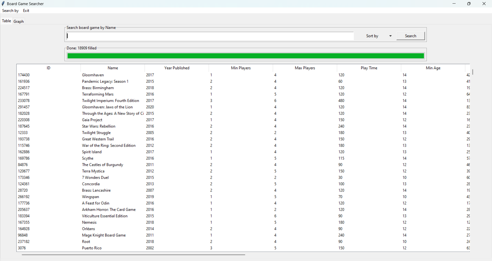
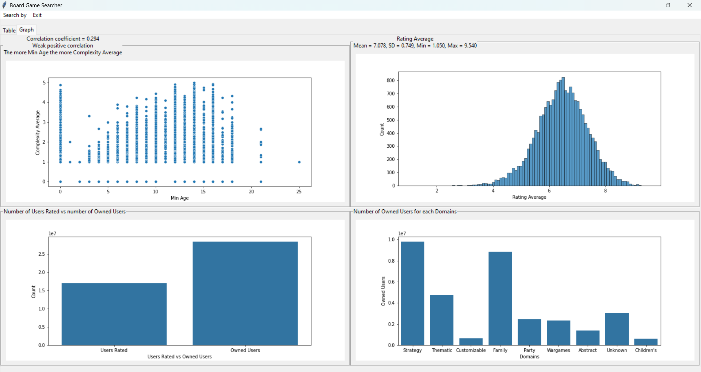

# Board Game Searcher

---

A table contains the data of board games from [kaggle](https://www.kaggle.com/datasets/andrewmvd/board-games)

This application is for searching a board game by given column also comes with sort. It also presents some statistic and graph in "Graph" page

| **Table page** |       |
|----------------|--------------------------------------|
| **Graph page** |  |

## Requirements

---
Python version 3.10.11 or better is required and the required python packages are list in [requirements.txt](https://github.com/0CreepySmile0/BoardGame_Searcher/blob/main/requirements.txt)

## Installation and set up virtual environment

---
See [installation](https://github.com/0CreepySmile0/BoardGame_Searcher/wiki/Installation)

Brief instruction:
1. Download the code to local directory and do the next step in the directory where the downloaded files are in
2. Create virtual environment `virtualenv env`
3. Activate virtual environment `env\Scripts\activate` (Windows) and install the required packages `pip install -r requirements.txt`

## Running the application

---
1. After done the installation part above run the command `python searcher_app.py` to start the application
2. When done and want to exit virtual environment do `deactivate` to exit

## Documents

---
Project-related documents can be found [here](https://github.com/0CreepySmile0/BoardGame_Searcher/wiki)

- [Screenshots](https://github.com/0CreepySmile0/BoardGame_Searcher/wiki/Screenshots)
- [UML class and sequence diagram](https://github.com/0CreepySmile0/BoardGame_Searcher/wiki/UML)
